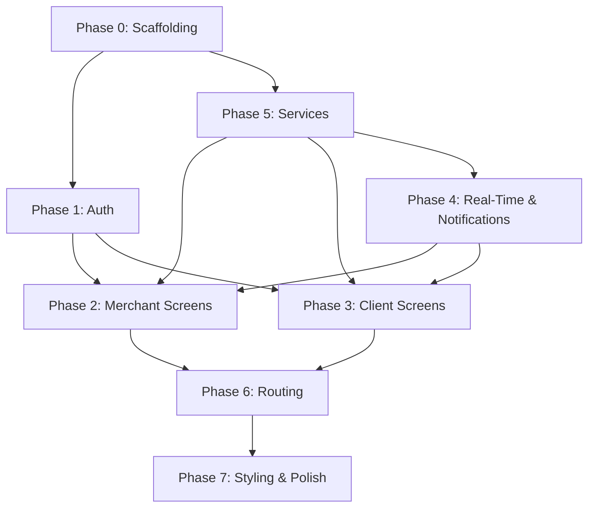

# Click & Collect — Appwrite Platform — Implementation Plan

A **Click & Collect** web application allowing **merchants** to manage product catalogs, inventory, orders, and opening schedules, and **clients** to browse products, build a cart, place orders, track pickup status, and manage pickup addresses. Backend is **Appwrite**. Frontend is **React + Vite + Tailwind CSS**.

---

## Full Scope

| Feature | Status |
|---|---|
| Auth (email/password, role-based) | ✅ |
| Merchant — CRUD products (with image) | ✅ |
| Merchant — Real-time inventory management | ✅ |
| Merchant — Availability notifications | ✅ |
| Merchant — View/manage pending orders | ✅ |
| Merchant — Mark order as ready/done | ✅ |
| Merchant — Order history | ✅ |
| Merchant — Sales statistics dashboard | ✅ |
| Merchant — Opening calendar management | ✅ |
| Client — Browse catalog by category | ✅ |
| Client — Product detail with photos | ✅ |
| Client — Cart with price summary | ✅ |
| Client — Place order + confirmation | ✅ |
| Client — Track order status (real-time) | ✅ |
| Client — Pickup notifications | ✅ |
| Client — Manage pickup addresses | ✅ |

---

## Data Model (Appwrite Collections & Bucket)

### Collection: `users`
| Field | Type | Description |
|---|---|---|
| `$id` | String | Appwrite ID |
| `email` | String | Unique email |
| `name` | String | Full name |
| `role` | String | `"merchant"` or `"client"` |
| `created_at` | DateTime | Creation date |

### Collection: `products`
| Field | Type | Description |
|---|---|---|
| `$id` | String | Appwrite ID |
| `name` | String | Product name |
| `price` | Number | Price |
| `image_id` | String | Reference to bucket file |
| `merchant_id` | String | Owner merchant |
| `category` | String | Product category |
| `stock` | Integer | Current inventory count |
| `available` | Boolean | Whether product is available |

### Collection: `categories` *(new)*
| Field | Type | Description |
|---|---|---|
| `$id` | String | Appwrite ID |
| `name` | String | Category name |
| `merchant_id` | String | Owner merchant |

### Collection: `orders`
| Field | Type | Description |
|---|---|---|
| `$id` | String | Appwrite ID |
| `client_id` | String | Client |
| `merchant_id` | String | Merchant |
| `status` | String | `"pending"`, `"ready"`, `"done"` |
| `total` | Number | Order total |
| `pickup_address_id` | String | FK to pickup_addresses |
| `created_at` | DateTime | Creation date |

### Collection: `order_items` *(new)*
| Field | Type | Description |
|---|---|---|
| `$id` | String | Appwrite ID |
| `order_id` | String | FK to orders |
| `product_id` | String | FK to products |
| `product_name` | String | Snapshot of name at order time |
| `quantity` | Integer | Quantity ordered |
| `unit_price` | Number | Snapshot of price at order time |

### Collection: `pickup_addresses` *(new)*
| Field | Type | Description |
|---|---|---|
| `$id` | String | Appwrite ID |
| `client_id` | String | Owner client |
| `label` | String | e.g. "Home", "Work" |
| `address` | String | Full address |
| `is_default` | Boolean | Default address flag |

### Collection: `opening_hours` *(new)*
| Field | Type | Description |
|---|---|---|
| `$id` | String | Appwrite ID |
| `merchant_id` | String | Owner merchant |
| `day_of_week` | Integer | 0 (Mon) – 6 (Sun) |
| `open_time` | String | e.g. "09:00" |
| `close_time` | String | e.g. "18:00" |
| `is_closed` | Boolean | Closed for the day |

### Collection: `notifications` *(new)*
| Field | Type | Description |
|---|---|---|
| `$id` | String | Appwrite ID |
| `user_id` | String | Recipient |
| `type` | String | `"availability"`, `"pickup_ready"`, `"order_update"` |
| `message` | String | Notification text |
| `read` | Boolean | Read status |
| `order_id` | String | Related order (optional) |
| `product_id` | String | Related product (optional) |
| `created_at` | DateTime | Creation date |

### Bucket: `product-images`
- Public read
- JPEG, PNG only
- Max 5 MB per image
- Path organization: `/merchant_id/product_id`

### Permissions Matrix
| Collection | Client | Merchant | Admin |
|---|---|---|---|
| users | Read self | Update self | All |
| products | Read | CRUD own | All |
| categories | Read | CRUD own | All |
| orders | Own | Own | All |
| order_items | Own | Read (via order) | All |
| pickup_addresses | CRUD own | — | All |
| opening_hours | Read | CRUD own | All |
| notifications | Read own | Read own | All |
| images (bucket) | Read | Read + Write own | All |

---

## Proposed Changes

### Phase 0 — Project Scaffolding

#### [DONE] Project root (Vite + React + Tailwind)
```
npx -y create-vite@latest ./ --template react
npm install appwrite react-router-dom
npm install -D tailwindcss @tailwindcss/vite vitest @testing-library/react
```

#### [DONE] [.env.example](file:///d:/Documents/appwrite_projet_tp/.env.example)
All Appwrite IDs: endpoint, project, database, collection IDs (users, products, categories, orders, order_items, pickup_addresses, opening_hours, notifications), bucket ID.

#### [DONE] [src/lib/appwrite.js](file:///d:/Documents/appwrite_projet_tp/src/lib/appwrite.js)
Appwrite SDK client, exports: `client`, `account`, `databases`, `storage`. Subscribes to Appwrite Realtime channels.

#### [DONE] [tailwind.config.js](file:///d:/Documents/appwrite_projet_tp/tailwind.config.js)
Tailwind config with custom color palette, Inter font.

---

### Phase 1 — Authentication & User Management

#### [DONE] [src/contexts/AuthContext.jsx](file:///d:/Documents/appwrite_projet_tp/src/contexts/AuthContext.jsx)
Provides `user`, `userDoc` (from users collection), `login()`, `register()`, `logout()`. On register, creates a `users` doc with chosen `role`.

#### [DONE] [src/pages/LoginPage.jsx](file:///d:/Documents/appwrite_projet_tp/src/pages/LoginPage.jsx)
Email + password login. Redirects merchant → `/merchant/dashboard`, client → `/client/catalog`.

#### [DONE] [src/pages/RegisterPage.jsx](file:///d:/Documents/appwrite_projet_tp/src/pages/RegisterPage.jsx)
Registration with name, email, password, role selector.

#### [DONE] [src/components/ProtectedRoute.jsx](file:///d:/Documents/appwrite_projet_tp/src/components/ProtectedRoute.jsx)
Route guard: check auth + optional role restriction.

---

### Phase 2 — Merchant Screens

#### [DONE] [src/pages/merchant/DashboardPage.jsx](file:///d:/Documents/appwrite_projet_tp/src/pages/merchant/DashboardPage.jsx)
Sales statistics: total orders, revenue, orders by status (pie/bar chart). Uses data from `orders` + `order_items`. Use a lightweight chart lib (e.g. `recharts`).

#### [DONE] [src/pages/merchant/ProductListPage.jsx](file:///d:/Documents/appwrite_projet_tp/src/pages/merchant/ProductListPage.jsx)
Product list with stock indicators (colored badges). Edit/delete actions. "Add Product" button. Real-time stock count display.

#### [DONE] [src/pages/merchant/ProductFormPage.jsx](file:///d:/Documents/appwrite_projet_tp/src/pages/merchant/ProductFormPage.jsx)
Create/Edit product: name, price, category (select from `categories`), stock quantity, image upload to bucket. Toggle availability.

#### [DONE] [src/pages/merchant/CategoryManagePage.jsx](file:///d:/Documents/appwrite_projet_tp/src/pages/merchant/CategoryManagePage.jsx)
CRUD for categories (name). Simple list with inline edit.

#### [DONE] [src/pages/merchant/OrderQueuePage.jsx](file:///d:/Documents/appwrite_projet_tp/src/pages/merchant/OrderQueuePage.jsx)
Pending orders list. Each order shows items, client info, total. Buttons: mark "ready" → triggers pickup notification to client.

#### [DONE] [src/pages/merchant/OrderHistoryPage.jsx](file:///d:/Documents/appwrite_projet_tp/src/pages/merchant/OrderHistoryPage.jsx)
Past orders (ready/done), filterable by date range.

#### [DONE] [src/pages/merchant/OpeningHoursPage.jsx](file:///d:/Documents/appwrite_projet_tp/src/pages/merchant/OpeningHoursPage.jsx)
Weekly calendar grid. Edit open/close times per day, toggle closed days.

#### [DONE] [src/components/merchant/MerchantLayout.jsx](file:///d:/Documents/appwrite_projet_tp/src/components/merchant/MerchantLayout.jsx)
Sidebar nav: Dashboard, Products, Categories, Orders (with pending badge), Schedule, Notifications.

---

### Phase 3 — Client Screens

#### [DONE] [src/pages/client/CatalogPage.jsx](file:///d:/Documents/appwrite_projet_tp/src/pages/client/CatalogPage.jsx)
Browse products by category (filter sidebar/tabs). Product cards: image, name, price, stock status badge, "Add to Cart" button (disabled if out of stock).

#### [DONE] [src/pages/client/ProductDetailPage.jsx](file:///d:/Documents/appwrite_projet_tp/src/pages/client/ProductDetailPage.jsx)
Full detail: photo, name, price, category, stock status, merchant opening hours display, "Add to Cart" with quantity selector.

#### [DONE] [src/pages/client/CartPage.jsx](file:///d:/Documents/appwrite_projet_tp/src/pages/client/CartPage.jsx)
Cart line items with quantity adjust, remove. Price summary (subtotal, total). Pickup address selector. "Place Order" CTA.

#### [DONE] [src/pages/client/OrderConfirmationPage.jsx](file:///d:/Documents/appwrite_projet_tp/src/pages/client/OrderConfirmationPage.jsx)
Confirmation screen: order ID, items summary, selected pickup address, estimated status.

#### [DONE] [src/pages/client/MyOrdersPage.jsx](file:///d:/Documents/appwrite_projet_tp/src/pages/client/MyOrdersPage.jsx)
Order list with real-time status updates via Appwrite Realtime subscription. Status badges: pending (yellow), ready (green), done (gray).

#### [DONE] [src/pages/client/PickupAddressPage.jsx](file:///d:/Documents/appwrite_projet_tp/src/pages/client/PickupAddressPage.jsx)
CRUD for pickup addresses. Set default address. Used during checkout.

#### [DONE] [src/contexts/CartContext.jsx](file:///d:/Documents/appwrite_projet_tp/src/contexts/CartContext.jsx)
Cart state: add, remove, update quantity, clear. Persisted in `localStorage`. Stock validation before adding.

#### [DONE] [src/components/client/ClientLayout.jsx](file:///d:/Documents/appwrite_projet_tp/src/components/client/ClientLayout.jsx)
Nav: Catalog, Cart (badge with count), My Orders, My Addresses, Notifications.

---

### Phase 4 — Real-Time & Notifications

#### [DONE] [src/hooks/useRealtime.js](file:///d:/Documents/appwrite_projet_tp/src/hooks/useRealtime.js)
Generic hook wrapping `client.subscribe()` for any Appwrite collection channel. Returns live-updated documents.

#### [DONE] [src/hooks/useNotifications.js](file:///d:/Documents/appwrite_projet_tp/src/hooks/useNotifications.js)
Subscribes to `notifications` collection for current user. Provides `unreadCount`, `notifications[]`, `markAsRead()`.

#### [DONE] [src/components/NotificationBell.jsx](file:///d:/Documents/appwrite_projet_tp/src/components/NotificationBell.jsx)
Bell icon with unread badge. Dropdown listing recent notifications.

#### [DONE] [src/components/NotificationToast.jsx](file:///d:/Documents/appwrite_projet_tp/src/components/NotificationToast.jsx)
Toast popup on new real-time notification (availability alert for merchant, pickup ready for client).

#### Real-time integration points:
- **Merchant `OrderQueuePage`**: subscribe to `orders` where `merchant_id` matches, auto-refresh on new order
- **Client `MyOrdersPage`**: subscribe to `orders` where `client_id` matches, live status badge updates
- **Merchant `ProductListPage`**: live stock update when orders are placed
- **Notifications**: subscribe to `notifications` collection for both roles

---

### Phase 5 — Shared Services

#### [DONE] [src/services/productService.js](file:///d:/Documents/appwrite_projet_tp/src/services/productService.js)
`listProducts(filters)`, `getProduct(id)`, `createProduct()`, `updateProduct()`, `deleteProduct()`, `uploadImage()`, `getImageUrl()`, `updateStock(id, delta)`.

#### [DONE] [src/services/categoryService.js](file:///d:/Documents/appwrite_projet_tp/src/services/categoryService.js)
`listCategories(merchantId)`, `createCategory()`, `updateCategory()`, `deleteCategory()`.

#### [DONE] [src/services/orderService.js](file:///d:/Documents/appwrite_projet_tp/src/services/orderService.js)
`createOrder(items, pickupAddressId)` — creates order + order_items docs, decrements stock. `listOrdersByMerchant()`, `listOrdersByClient()`, `updateOrderStatus()` — triggers notification creation.

#### [DONE] [src/services/userService.js](file:///d:/Documents/appwrite_projet_tp/src/services/userService.js)
`createUserDoc()`, `getUserDoc()`.

#### [DONE] [src/services/addressService.js](file:///d:/Documents/appwrite_projet_tp/src/services/addressService.js)
`listAddresses(clientId)`, `createAddress()`, `updateAddress()`, `deleteAddress()`, `setDefault()`.

#### [DONE] [src/services/scheduleService.js](file:///d:/Documents/appwrite_projet_tp/src/services/scheduleService.js)
`getOpeningHours(merchantId)`, `upsertOpeningHour(day, open, close, isClosed)`.

#### [DONE] [src/services/notificationService.js](file:///d:/Documents/appwrite_projet_tp/src/services/notificationService.js)
`createNotification(userId, type, message, refs)`, `listNotifications(userId)`, `markAsRead(id)`.

#### [DONE] [src/services/statsService.js](file:///d:/Documents/appwrite_projet_tp/src/services/statsService.js)
`getMerchantStats(merchantId)` — aggregates: total orders, revenue, orders by status, top products. Computed client-side from orders + order_items queries.

---

### Phase 6 — Routing & App Shell

#### [DONE] [src/App.jsx](file:///d:/Documents/appwrite_projet_tp/src/App.jsx)
React Router config:
```
/login, /register                         → public
/merchant/dashboard                       → DashboardPage
/merchant/products                        → ProductListPage
/merchant/products/new                    → ProductFormPage
/merchant/products/:id/edit               → ProductFormPage
/merchant/categories                      → CategoryManagePage
/merchant/orders                          → OrderQueuePage
/merchant/orders/history                  → OrderHistoryPage
/merchant/schedule                        → OpeningHoursPage
/client/catalog                           → CatalogPage
/client/catalog/:id                       → ProductDetailPage
/client/cart                              → CartPage
/client/orders                            → MyOrdersPage
/client/orders/:id/confirmation           → OrderConfirmationPage
/client/addresses                         → PickupAddressPage
/                                         → redirect by role
```

#### [DONE] [index.html](file:///d:/Documents/appwrite_projet_tp/index.html)
SEO meta tags, title "Click & Collect", Inter font link.

---

### Phase 7 — Styling & Polish

#### [DONE] [src/index.css](file:///d:/Documents/appwrite_projet_tp/src/index.css)
Tailwind directives, CSS custom properties, global resets, Inter font, dark mode support.

#### Component-level: Tailwind utility classes throughout all components.

#### Micro-animations: page transitions, button hover effects, notification toast slide-in, cart badge bounce.

---

## Dependency Graph



---

## Verification Plan

### Appwrite Setup (Manual — User)
1. Create Appwrite project (cloud or self-hosted)
2. Create database with all 8 collections: `users`, `products`, `categories`, `orders`, `order_items`, `pickup_addresses`, `opening_hours`, `notifications`
3. Set field types per schemas above
4. Create `product-images` bucket (public read, JPEG/PNG, 5 MB max)
5. Set collection-level permissions per matrix
6. Copy all IDs into `.env`

### Automated Tests (Vitest)
| Test File | What It Tests |
|---|---|
| `productService.test.js` | CRUD + stock update logic |
| `orderService.test.js` | Order creation, stock decrement, status transitions |
| `CartContext.test.jsx` | Add/remove/quantity/clear, stock validation |
| `notificationService.test.js` | Create + mark read |
| `statsService.test.js` | Revenue/order aggregation |

**Run:** `npx vitest run`

### Manual E2E Verification (Browser)
1. **Register** merchant → verify `role: "merchant"` in users collection
2. **Merchant**: create categories → appear in list
3. **Merchant**: set opening hours → calendar displays correctly
4. **Merchant**: create product with image, stock = 10 → product appears, image loads
5. **Register** client → verify `role: "client"`
6. **Client**: browse catalog → filter by category works, stock badge shows
7. **Client**: add pickup address → appears in address list, can set default
8. **Client**: add to cart (qty 3) → cart shows correct total
9. **Client**: place order → confirmation screen, order in "My Orders" (pending)
10. **Merchant**: new order appears in queue (real-time) → stock decremented by 3
11. **Merchant**: mark order "ready" → client receives notification, status updates real-time
12. **Merchant**: mark order "done" → moves to history
13. **Merchant**: dashboard shows updated stats (1 order, correct revenue)
14. **Client**: attempt to add out-of-stock product → button disabled
15. **Notifications**: verify bell shows unread count, toast appears on new notification
